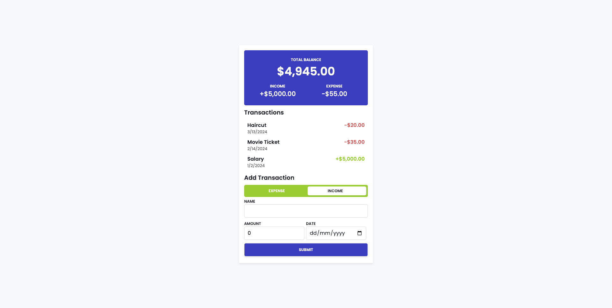

# Expense_Tracker_App
Tracks your daily expense 


# Expense Tracker

A simple, responsive web application for tracking income and expenses.

## Table of Contents

- [Overview](#overview)
- [Features](#features)
- [Technologies Used](#technologies-used)
- [Screenshots](#screenshots)
- [How to Use](#how-to-use)
- [Setup](#setup)
- [License](#license)

---

## Overview

The Expense Tracker is a minimalist web application designed to help users record and manage their financial transactions. It provides a user-friendly interface for adding and viewing income and expenses.

---

## Features

- **Total Balance Calculation**: Displays the overall financial balance.
- **Income and Expense Tracking**: Separate categorization for income and expenses.
- **Transaction History**: Lists all recorded transactions with dates.
- **Add/Delete Transactions**: Easy addition and deletion of transactions.

---

## Technologies Used

- **HTML5**: Structure and layout.
- **CSS3**: Styling and responsiveness.
- **JavaScript**: Application logic.
- **LocalStorage**: Persistent data storage.

---

## Screenshots

### Main Interface


---

## How to Use

1. Open the application in your browser.
2. Add a transaction by entering:
   - **Name**: Name of the transaction.
   - **Amount**: Amount of the transaction (positive for income, negative for expense).
   - **Date**: Date of the transaction.
3. View the updated balance and transaction history.
4. Delete a transaction if necessary by clicking the delete icon next to it.

---

## Setup

To run this project locally:

1. **Clone the repository**:
   ```bash
   git clone https://github.com/your-username/expense-tracker.git
